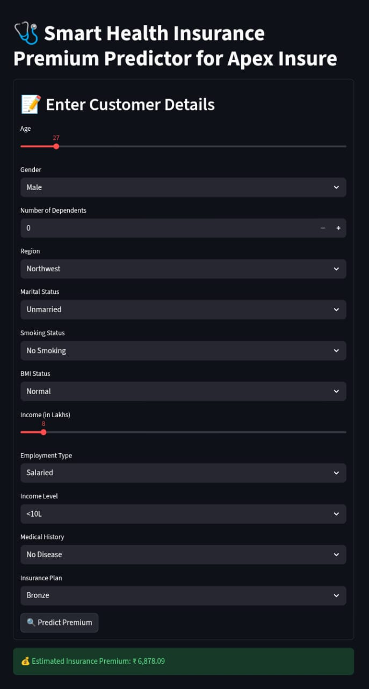

# Smart Health Insurance Premium Predictor

This project predicts health insurance premiums based on user details like age, BMI, smoking habits, and region. It uses machine learning to provide an estimated premium, helping users understand the factors affecting insurance costs.

## Features
- User-friendly interface built with Streamlit  
- Predicts insurance premium using trained ML model  
- Interactive inputs for health and lifestyle factors  
- Real-time result generation  

## Tech Stack
- Python  
- Streamlit  
- Scikit-learn / other ML libraries  
- Pandas, NumPy  

## Project Demo
You can try the live app here:  
👉 [Project URL](https://smart-health-insurance-premium-predictor-gqm3trgmnikhukbotxjpk.streamlit.app/)

## Screenshot

